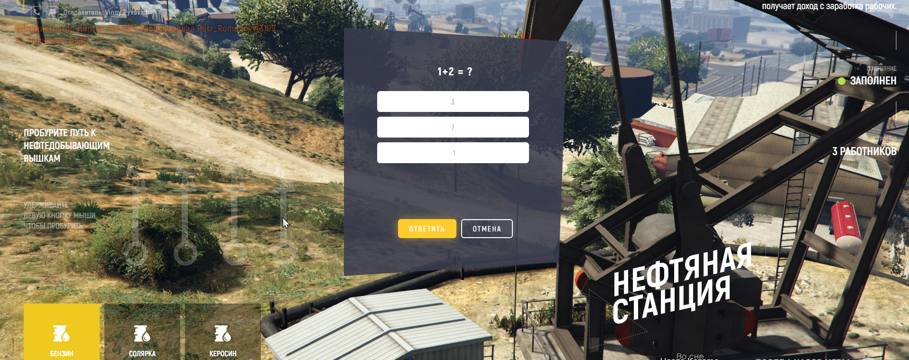

# GTA 5 Rage RP worker bot (Miner and Oil man) 

## Purposes of the bot
The main idea of the bot was to have fun making something, that will interact with the game and perform routine work.

There are two main mini games on the current RAGE RP mode server: **quarry** and **oil tower**.
The essence of mini games is to perform some simple actions, like pressing some key for a certain time or
to click on oils until they are filled.
After successful iteration gamer gains some resource, that later could be sold for game currency.

After some number of iterations, simple captcha is appeared and should be solved. After captcha is solved, the mini game contunies.

## Captcha example

## Bot architecture
Bot consist of worker and OCR engine to solve the captcha.

#### Workers:
* Miner
* Oil man
#### OCR engines:
* GOCR
* Calamari OCR

Both workers encapsulate algorithm to play their game. Workers are controlled via keyboard shortcuts.
Worker could be _paused_, _stopped_, _restarted_ and _resumed_. Events from the keyboard are handled concurrently.

## Solving the captcha
### Problem
The idea was to recognize terms from question, recognize answers, find correct answer number and answer the captcha.

### Preparing images
First of all - capture screenshot. Bot is ready to work only with full hd resolution.
To achieve question numbers clarity independent of background, captcha background was artificially made black.
After picture is cropped, there is a package - repainter, that will find all the pixels,
that look like white and color everything else to black and invert colors after that.

### Recognition
#### Gosseract
First try was `gosseract` library which is the wrapper over google tesseract. It has a big rate of false predictions
in term of recognizing numbers. Was skipped very fast.

#### Calamari OCR
Second try was `calamari ocr` solution, that is written in Python and use Tensorflow to train models and predict pictures.
A dataset of about 80 pictures of questions and three times as many pictures of answers was used to train model.
This solution has a very good percent of correct predictions, but it needs about 7 seconds to predict all the pictures.

#### GOCR
The third try was `GOCR` - An open source program, that can recognize images. After few tests it was considered as
perfect solution, because for the last version of processed images it had 100% of predictions
and more importantly - instant prediction speed.

## Results
Bot could work on oil tower 24/7, solving captcha and storing resources to the car, if `--storage` flag is passed.
It also doesn't have much (with `GOCR` engine) dependencies to install: `git` and `minGW`.

## Technical information
Bot is written in Golang
### Libraries used
* robotgo - screenshots capturing, keys and mouse manipulations, key tap event bindings, obtaining pixels color;
* cutter - for cropping images;
* cobra - as framework to build command line programs.
